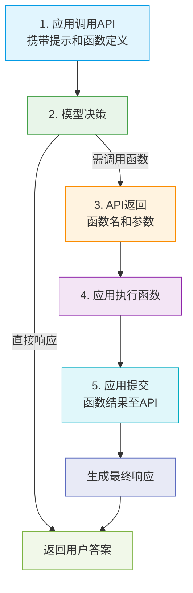

# Openai-practise
this ia project for tracing new openai SDK usage

## function calling

| 步骤 | 执行方 | 关键动作              | 数据格式示例                                                 |
| :--- | :----- | :-------------------- | :----------------------------------------------------------- |
| 1    | 应用   | 发送用户输入+函数定义 | `{"messages":[...], "functions":[...]}`                      |
| 2    | 大模型 | 决策响应方式          | 生成`tool_calls`或直接回答                                   |
| 3    | 大模型 | 返回函数调用          | `{"tool_calls": [{"name": "func", "arguments": {...}}]}`     |
| 4    | 应用   | 执行本地函数          | 解析参数并调用`func(**args)`                                 |
| 5    | 应用   | 提交执行结果          | `{"tool_call_id": "...", "role": "tool", "content": "result"}` |
